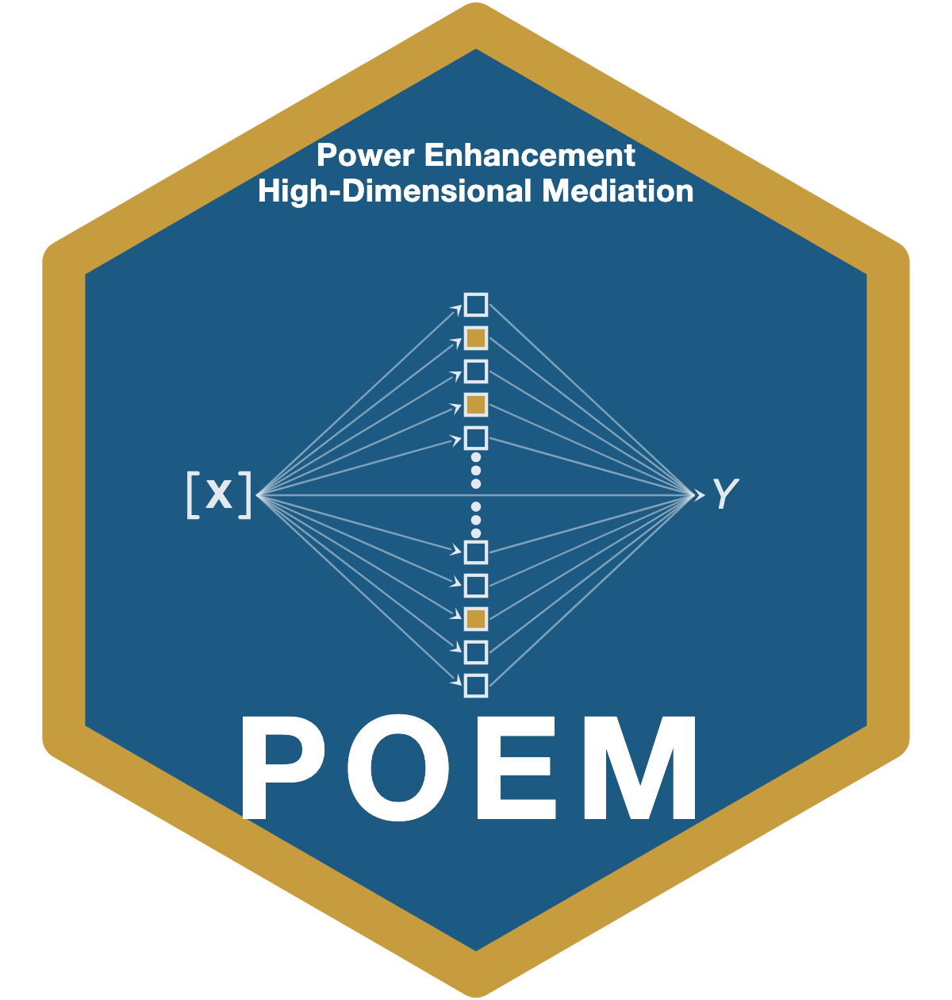

# POEM: Power Enhancement for High-Dimensional Mediation Analysis 

POEM implements powerful global tests for high-dimensional mediation
analysis, for continuous, binary, and count outcomes. It answers the
question *"is there any active mediator among a large set of candidate
mediators?"* and, when the answer is yes, identifies which individual
mediators are active. The name comes from POwer-Enhanced Mediation.

## Why power enhancement

The conventional high-dimensional mediation test targets the **total
indirect effect** `beta = Gamma_x' alpha_m`, the sum of every mediator's
individual indirect effect. When some indirect effects are positive and
others negative they can cancel, making `beta = 0` even though active
mediators exist, and a test built on `beta` is then powerless. The
power-enhanced (PE) test adds a component `J_m` that accumulates the
marginal signal from each individual mediator. Because `J_m` sums
magnitudes, opposite-signed effects reinforce rather than cancel, so the
test stays powerful under heterogeneous and contrasting mediation while
preserving the Type I error rate of the benchmark test under the global
null.

## When to use POEM

POEM answers the global question, *"is there any active mediator among
many candidates?"*, and then names the active ones. Reach for it when the
candidate mediators number in the dozens or more (`p` may exceed `n`), the
outcome is continuous, binary, or a count, and the individual mediation
effects may differ in sign. For a single mediator, or a few mediators fit
as one structural model (indirect effects with confidence intervals,
likelihood ratio tests of arbitrary indirect effects, moderated
mediation), use [DMAR](https://CRAN.R-project.org/package=DMAR) instead.
Among high-dimensional global tests, POEM implements the power-enhanced
tests of Yu and Kelley (in press) and the HDMM benchmark they extend;
HILMA, GlobalTest, HDMT, and DACT are separate methods in their own
packages, and the vignette `poem-vs-competitors` shows how to run them
beside a POEM fit. The guided-tour vignette and `?pe_mediation` state the
method's practical limits (small `n`, strongly correlated mediators, rare
binary outcomes, overdispersed counts, missing data).

## Installation

Once POEM is on CRAN:

```r
install.packages("POEM")
```

The development version, from GitHub:

```r
# install.packages("remotes")
remotes::install_github("yelleKneK/POEM", build_vignettes = TRUE)
```

POEM imports `glmnet` and `ncvreg`; `knitr` and `rmarkdown` build the
vignettes. After installing, `browseVignettes("POEM")` opens the guides.

## Quick start

```r
library(POEM)

# A contrasting setting: active mediators whose indirect effects cancel,
# so the total indirect effect is zero.
set.seed(113)
d <- simulate_mediation_data(n = 200, p = 60, outcome = "continuous",
                             pattern = "contrasting", c1 = 1)

# One call reports the benchmark Wald test and the power-enhanced test
# side by side, and names the active mediators it found.
pe_mediation(d$X, d$Y, d$M, outcome = "continuous")
```

The benchmark test (`pval_hdmm`) does not reject the (zero) total indirect
effect; the power-enhanced test (`pval_pe`) rejects decisively and
identifies an active mediator. The footer also reports the tuning
parameter the high-dimensional BIC chose and the grid it was chosen from.

## Reproducing the article

All data needed to reproduce the paper ship with the package; nothing is
downloaded at run time. The vignette **`reproducing-the-article`**
walks through every analysis section by section; the table below maps each
article result to the function that reproduces it.

| Article result | Reproduce with |
|---|---|
| Section 4.1 linear-model size/power figures | `pe_power_curve(outcome = "continuous", pattern = "homogeneous" / "contrasting")` |
| Section 4.2 logistic / Poisson figures | `pe_power_curve(outcome = "binary", c2 = 1)` and `pe_power_curve(outcome = "count", c2 = 0.4)` |
| Supplement Section S.4.1: FWER/FDR mediator-identification study | `pe_identification_study()` |
| Supplement: real-data-motivated heterogeneous setting | `simulate_guo_mediation()` with the shipped `guo_calibration` constants |
| Section 5 real-data tables (IMR, U5MR, LEB, LBW, PoU) | `WHO_mediation_analysis("imr")`, `"u5mr"`, `"leb"`, `"lbw"`, `"pou"` |
| Supplement: extended tables (PE / PE-BH / PE-BY columns) | `WHO_mediation_analysis(..., full_table = TRUE)` |
| Where PE detects mediation the benchmark misses | `summary()` of a `WHO_mediation_analysis()` result |

The Monte Carlo figures use the article's `n = 300`, `p = 500`, and
1,000 replications; the vignette runs reduced versions for speed and gives
the exact article settings in `eval = FALSE` blocks. Set `cores > 1` to
parallelize (near-linear). The real-data tables are deterministic and are
checked against the published values by the package's test suite
(`tests/testthat/test-benchmark.R`).

```r
# Reproduce the article's infant-mortality table (Table 1).
WHO_mediation_analysis("imr", groupings = c("global", "region", "income"))
```

## Vignettes

```r
browseVignettes("POEM")
```

- **`POEM`**: a guided tour of the method and the package.
- **`reproducing-the-article`**: section-by-section reproduction.
- **`poem-vs-competitors`**: a head-to-head against the benchmark test.

## Main functions

| Function | Purpose |
|---|---|
| `pe_mediation()` | Front end; dispatches on outcome type (continuous / binary / count) |
| `pe_mediation_linear()` / `_logistic()` / `_poisson()` | Outcome-specific workers |
| `pe_mediate()` | Data-frame / formula front end |
| `pe_mediators()` / `pe_selection()` | Per-mediator screen detail; PE statistic and active set per multiplicity method |
| `plot()` / `tidy()` / `glance()` / `summary()` | Plot, broom verbs, and a cross-group comparison digest |
| `simulate_mediation_data()` | Generate data under homogeneous / contrasting patterns |
| `simulate_guo_mediation()` / `guo_calibration` | The real-data-motivated heterogeneous setting and its constants |
| `pe_power_curve()` / `pe_simulation_study()` | Monte Carlo size and power study |
| `pe_identification_study()` | Monte Carlo FWER / FDR / precision / recall of mediator identification |
| `ss_power_pe_mediation()` | Sample-size planning for a target power |
| `WHO_mediation_design()` / `WHO_mediation_analysis()` | Build / run the benchmark health-expenditure analysis |

Every test reports the benchmark Wald test and the power-enhanced test
side by side, plus a confidence interval for the total indirect effect;
`report_all_methods = TRUE` adds the active set and PE p-value under all
three multiplicity methods, `drop_constant = TRUE` tolerates zero-variance
mediators, and `cores` parallelizes the Monte Carlo and benchmark
routines.

## Data

- `WHO_health_mediation`: the empirical panel analyzed in the article:
  91 World Health Organization member states over 2000--2021, with GDP per
  capita growth as the exposure, 57 WHO Global Health Expenditure Database
  indicators as candidate mediators, and five World Bank health outcomes
  (infant and under-five mortality, life expectancy, low birthweight,
  undernourishment).
- `WHO_indicator_codebook`: definitions of the 57 indicators.
- `guo_calibration`: constants for the real-data-motivated heterogeneous
  simulation.
- `example_continuous`, `example_binary`, `example_count`: small
  simulated data sets, one per outcome type.

## Reference

Yu, X., & Kelley, K. (in press). Power Enhancement in High-Dimensional
Heterogeneous Mediation Analysis. *Journal of the American Statistical
Association*.

Run `citation("POEM")` for the BibTeX entry.

## Authors

- **Xiufan Yu**, Department of Applied and Computational Mathematics and
  Statistics, University of Notre Dame.
- **Ken Kelley** (maintainer), Department of IT, Analytics, and Operations,
  University of Notre Dame (<kkelley@nd.edu>).

## License

GPL (>= 3).
